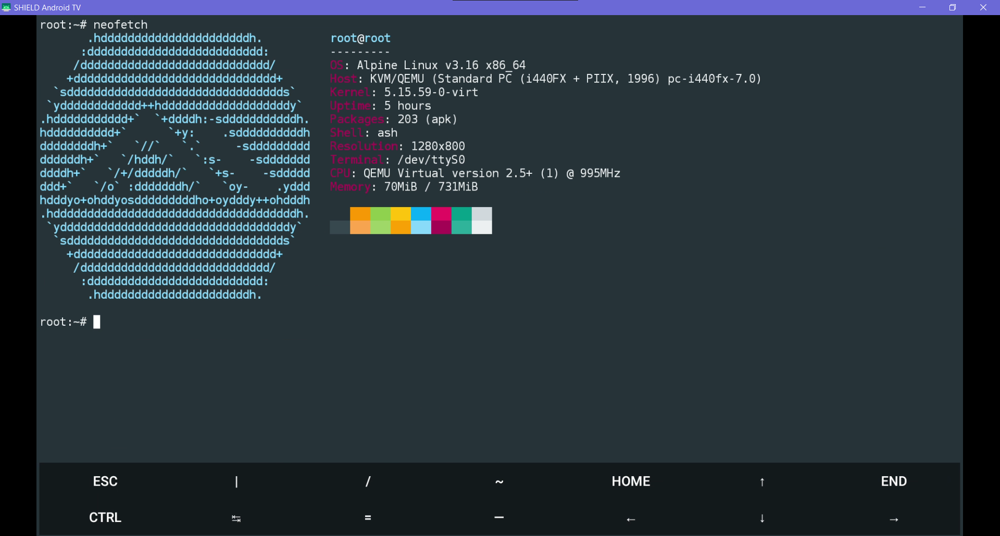

# docker-on-termux
setup [docker](https://www.docker.com) on [termux](https://www.qemu.org), as well as other things.

## ☕ donations

while completely optional, it would be highly appreciated if you could donate if you find this tutorial helpful! it can be of any amount.

[](https://paypal.me/irbee246)

<br/>

## NEW NOTE - USE PROOT

at the time of writing this, i did not know of the existence of [proot](https://proot-me.github.io).

through proot, it is possible for to use an app such as [andronix](https://andronix.app) which has a list of install scripts for any distro you want (i prefer ubuntu, it avoids the extra setup alpine requires), even with desktop and window managers to access through vnc.

this achieves the same purpose as qemu and doesn't have a long startup time that qemu has. it can still executing programs built for another CPU architecture transparently through qemu user-mode and create a root filesystem separate from the main system like qemu does. 

thus, there is no disadvantage, and i **recommend** it over qemu.

and the goal of this guide is not **qemu on termux** but **docker on termux**, so please use proot with a distro install script for a way better experience. the instructions they give are straightforward in the app, so i won't list them here.

[click here to script past the qemu install process if you so desire](https://github.com/Slick9000/docker-on-termux#setup-docker-on-alpine). the only difference is not rather than **apk**, you will have to use the package manager of the distro you installed to install these packages (debian, ubuntu and any other debian-based distros use **apt**. look up which one your distro uses if unsure.

if you're having issues with root priviledges, you can try [udocker](https://github.com/indigo-dc/udocker), which executes in user mode rather than root.

<br/>

## what is [qemu](https://www.qemu.org)?

if you are unaware as to what [qemu](https://www.qemu.org) is, [qemu](https://www.qemu.org), is a free and open-source emulator, that is able to emulate machine processors with full operating system emulation, similar to other virtual machine applications such as [virtualbox](https://www.virtualbox.org/), allowing you to run one operating system on another. however [qemu](https://www.qemu.org) works natively as a package in [termux](https://github.com/termux/termux-app).

<br/>

## why use [qemu](https://www.qemu.org)/a virtual linux environment on [termux](https://github.com/termux/termux-app)?

- in my use case, i use [qemu](https://www.qemu.org) to run [docker](https://www.docker.com), which usually cannot run natively on [termux](https://github.com/termux/termux-app) due to limitations in the android kernel. some people have gone the route of creating their own custom kernel to work around this, but this method not only requires experience, but may not be guaranteed to work properly. by using qemu, you can run any x86 programs you desire!

- it also allows me to run programs which typically require a rooted device without having to root my phone (i prefer not to root my android device).

- on top of all of that, transfers from one device to another are made easy, as all you need to transfer is the boot image, and reinstall [qemu](https://www.qemu.org) on the new device, and all of the setup remains identical (tested and works flawlessly).

<br/>

## why do you prefer to use a phone as a docker server?

i have several old android devices that are currently not in use, and i didn't have a device like a raspberry pi to run a linux server on. 

with [termux](https://github.com/termux/termux-app), i knew it would be possible to run my [docker](https://www.docker.com) server through it. all [termux](https://github.com/termux/termux-app) requires is some free storage space and android 7+ (**android 5** if you use [termux-v0.79-offline-bootstraps](https://archive.org/download/termux-repositories-legacy/termux-v0.79-offline-bootstraps.apk) and follow [these instructions](https://android.stackexchange.com/a/247272)) and you are good to go, which would save you money from having to buy another device for a server.

<br/>

## why [alpine](https://www.alpinelinux.org)?

simply put, i tried [ubuntu](https://ubuntu.com/), but it either didn't want to boot at all, or it takes so long to boot in [qemu](https://www.qemu.org) i decided it wasn't the distro i wanted.

after some searching for other distros i decided to try [alpine](https://www.alpinelinux.org). [alpine](https://www.alpinelinux.org) has a distribution called virt, which is designed specifically for virtual machines such as [qemu](https://www.qemu.org) and works very well. i was able to install and setup in less than 10 minutes. 

[ubuntu](https://ubuntu.com/) is also around 2-3gb in size, while [alpine](https://www.alpinelinux.org)'s is much smaller (the iso for [alpine](https://www.alpinelinux.org) virt is ~39mb, and when setup it's very small in size as well). while for the modern user this may not be problematic, it's still nice to prevent bloating your device storage.

**[*] keep in mind, [qemu](https://www.qemu.org) will take a while to boot [alpine](https://www.alpinelinux.org) (it can take up to 4 minutes). so don't think that it's not working, it's simply just qemu's boot time for alpine. once it's started however, it works flawlessly!**

<br/>

## instructions to install [qemu](https://www.qemu.org) and [alpine](https://www.alpinelinux.org)

after installing [termux](https://github.com/termux/termux-app), run:

```
pkg update -y && pkg upgrade -y
```

this will make sure all [termux](https://github.com/termux/termux-app) packages are up to date.

```
pkg install x11-repo
```

x11-repo contains the package for [qemu](https://www.qemu.org) and it's tools.

```
pkg install qemu-system-x86_64 -y && pkg install qemu-utils
```

yay! you have [qemu](https://www.qemu.org) installed! now, to create a boot image for [qemu](https://www.qemu.org) to be able to read.

```
qemu-img create -f qcow2 hdd.img 16G
``` 

16G can be altered to any storage size you want, in gigabytes.

now, you need to actually download the file for [alpine](https://www.alpinelinux.org) linux!

```
wget https://dl-cdn.alpinelinux.org/alpine/v3.16/releases/x86_64/alpine-virt-3.16.2-x86_64.iso
```

now, to actually run [alpine](https://www.alpinelinux.org) linux in [qemu](https://www.qemu.org)! run:

```
qemu-system-x86_64 -cdrom alpine-virt-3.12.3-x86_64.iso -m 2048 -hda hdd.img -nographic
```

note: if you prefer to use vnc, run:

```
qemu-system-x86_64 -cdrom alpine-virt-3.12.3-x86_64.iso -m 2048 -hda hdd.img -vnc 127.0.0.1:1
```

<br/>

**to explain these commands**:

-cdrom points to the iso of [alpine](https://www.alpinelinux.org)

-m sets the amount of memory/ram [alpine](https://www.alpinelinux.org) is allowed to use (for me, 2gb is plenty enough.)

-hda points to the boot image needed for [qemu](https://www.qemu.org)

-vnc creates creates a local vnc server for [qemu](https://www.qemu.org) to run through by the local ip and port of the device

once you're all booted up, it will now ask for a localhost login password. the pass is: root

```
setup-alpine
``` 

to perform the regular [alpine](https://www.alpinelinux.org) setup. (personally, i usually set the username and password both as root, set the hdd.img as the sys storage partition, and leave everything else as default).

once setup, it will ask you to restart it to finish it's installation.

```
poweroff
```

to relaunch, run:

```
qemu-system-x86_64 -hda hdd.img -m 2048 -nographic
```

again, if you prefer to use vnc, run:

```
qemu-system-x86_64 -hda hdd.img -m 2048 -vnc 127.0.0.1:1
```

these will be the commands used for every boot from now on.

<br/>

## unlock full functionality of the package manager in [alpine](https://www.alpinelinux.org)

to install some programs such as [docker](https://www.docker.com), you will need to unlock the community package in the apk package manager.

you can do this by either using:

<br/>

1. **micro**, better editor for beginners with keybinds similar to [vs code](https://code.visualstudio.com) and [notepad++](https://notepad-plus-plus.org), [click here if you want to install it](https://github.com/Slick9000/docker-on-termux#install-micro-text-editor-requires-curl-see-previous)
2. **vim**, which i'll be using for this tutorial. i recommend it for intermediate users, however i will walk you through it if you're unfamiliar.

<br/>

to do so, you'll need to edit the packages file using a text editor. i'll be using [vim](https://www.vim.org) for this tutorial. install [vim](https://www.vim.org) by running:

```
apk add --update vim
```

then:

```
vim /etc/apk/repositories
```

once in here, you must remove the # (comment character) from the second line, which says:
#http://mirror.reeningne.net/alpine/v3.16/community

>  press i to enter insert mode

>  delete the comment, making it read:

http://mirror.reeningne.net/alpine/v3.16/community

>  press esc to exit insert mode

>  exit by pressing : (colon), typing wq and pressing enter.

now, you have unlocked the community packages not included in the main [alpine](https://www.alpinelinux.org) installation such as [docker](https://www.docker.com).

for those unfamiliar with vim that enjoyed using it, you can learn more with the [cheat sheet!](https://vimsheet.com)

<br/>

## setup [docker](https://www.docker.com) on [alpine](https://www.alpinelinux.org).

now, you may think it would be as simple as just:

```
apk add --update docker openrc
```

and then just:

```
docker run {package}
```

...right? well... no.

if you try to do this, you will receive the error:

`Cannot connect to the [docker](https://www.docker.com) daemon at unix:///var/run/docker.sock. Is the [docker](https://www.docker.com) daemon running?`

now the first thing you're probably thinking is: what the hell does that mean?

essentially, the [docker](https://www.docker.com) package is a service, one which must run in the background at all times.

(similar to programs such as your system clock or weather programs).

for whatever reason, it is not automatically set as a service on install.

so you simply have to set it as a default service! you can do so by performing:

```
rc-update add docker default 
```

this will make the [docker](https://www.docker.com) service run automatically on all future startups of [alpine](https://www.alpinelinux.org).

however to begin it without restarting, run:

```
rc-service docker start
```

and now you can use [docker](https://www.docker.com)!

obviously to run a docker container, run:

```
docker run {args}
 ```

to stop a [docker](https://www.docker.com) container, run:

```
docker stop {docker container id}
```

to see all existing [docker](https://www.docker.com) containers, run:

```
docker ps -a
```

to remove a [docker](https://www.docker.com) container, run:

```
docker rm {docker container id}
```
 
 to view installed docker images, run:
 
 ```
 docker images -a
 ```
 
 to delete a docker image, run:
 
 ```
 docker rmi {image id}
 ```
 
 to remove *all* docker resources (containers, volumes, networks, etc), run:
 
 ```
 docker system prune -a
 ```

<br/>

## setup a terminal multiplexor([tmux](https://github.com/tmux/tmux/wiki)) in [alpine](https://www.alpinelinux.org)

in the case that you would like to run multiple services at once in [alpine](https://www.alpinelinux.org), such as a discord bot, an nginx server, and a plex server, it is recommended you get [tmux](https://github.com/tmux/tmux/wiki).

to install, run:

```
apk add --update tmux
```

from there to create a window, you can do:

```
tmux
```

now everything you do in this environment is set to this window. do:

```
Ctrl-B + D 
```

to leave the window

to create a new window, simply do:

```
tmux
```

or run the command

```
Ctrl-B + C
```

to move to the previous window, run:

```
Ctrl-B + P
```

to move to the next window, run:

```
Ctrl-B + N
```

to immediately move to a specific window (0-9), run:

```
Ctrl-B {number}
```

to reattach to a window, do:

```
tmux attach -t {session number}
```

to view all running windows, do:

```
tmux ls
```

to close a window, do:

```
Ctrl-B + X (while attached)
```

or run the command

```
tmux kill-session -t {session number}
```

to kill all sessions besides the specified session, do:

```
tmux kill-session -a -t {session number}
```

very useful if you open a lot of sessions at once.

<br/>

## setup [python](https://www.python.org) in [alpine](https://www.alpinelinux.org)

now everybody knows that having [python](https://www.python.org) in your back pocket is always useful, though it's not as simple as pkg install [python](https://www.python.org) is in [termux](https://github.com/termux/termux-app). here are the commands needed to install it on [alpine](https://www.alpinelinux.org):

```
apk add --update --no-cache python3
```

```
ln -sf python3 /usr/bin/python
```

```
python3 -m ensurepip
```

```
pip3 install --no-cache --upgrade pip setuptools
```

<br/>

## setup [ngrok](https://ngrok.io) in [alpine](https://www.alpinelinux.org)

[ngrok](https://ngrok.io) is a very easy-to-use, secure port forwarding service which i use for forwarding my server across the net.

to set it up in alpine, do:

```
wget https://bin.equinox.io/c/4VmDzA7iaHb/ngrok-stable-linux-amd64.tgz
```

to download the installer file, then to install, run:

```
tar xvf ngrok-stable-linux-amd64.tgz -C /usr/local/bin
```

and wait for it to finish installing.

once installed, you can add your authtoken to [ngrok](https://ngrok.io) by running:

```
ngrok authtoken {token}
```

and run the port forwarding service using:

```
ngrok http {port}
```

<br/>

## setup [curl](https://curl.se) in [alpine](https://www.alpinelinux.org)

probably the easiest setup in this tutorial, simply run:

```
apk add --update curl
```

<br/>

## install [micro](https://micro-editor.github.io) text editor (requires [curl](https://curl.se), see previous)

**if you came from the package manager section, you can return there by clicking [here](https://github.com/Slick9000/docker-on-termux#unlock-full-functionality-of-the-package-manager-in-alpine) to finish the tutorial**

for users who aren't familiar with [vim](https://www.vim.org) (or aren't a fan of the keybind-heavy workflow it has) [micro](https://micro-editor.github.io) is a clean, modern alternative for those familiar with keybinds similar to [Microsoft's Visual Studio (VS) Code](https://code.visualstudio.com).

**EDIT:** navigation with arrow keys in [micro](https://micro-editor.github.io) appears to be dreadfully slow. maybe stick to [vim](https://www.vim.org) for text editing on this configuration, however i will vouch for [micro](https://micro-editor.github.io) as a solid text editor on regular linux systems, and due to it using [curl](https://curl.se), the installation method is the same on any other linux distro.

with [curl](https://curl.se) installed, run:

```
curl https://getmic.ro | bash
```

then, to be able to run [micro](https://micro-editor.github.io) from anywhere, run:

```
mv micro /usr/bin
```

to move it to the user apps directory.

you can edit files now by running:

```
micro {filename}
```

the bindings are relatively easy and similar to regular editors (Ctrl + S to save, Ctrl + Q to quit, etc). to see the full list, use `Alt + G` to see the full list of bindings, and `Ctrl + H` to get help with anything else.

<br/>

## conclusion

these are all of the setup tips i can provide for setting up [alpine](https://www.alpinelinux.org) through [qemu](https://www.qemu.org) in [termux](https://github.com/termux/termux-app), with [docker](https://www.docker.com), [vim](https://www.vim.org), [tmux](https://github.com/tmux/tmux/wiki), [python](https://www.python.org), [ngrok](https://ngrok.io), [curl](https://curl.se) as well as [micro](https://micro-editor.github.io). i use this setup everyday, and it runs flawlessly once all set up. give it a try yourself if you'd like.

of course, it is also possible to set up a desktop environment or window manager for [alpine](https://www.alpinelinux.org) and view it through vnc, but personally i don't use one and just stick to the shell. this was also made to assist with things that may be difficult to understand and setup in [qemu](https://www.qemu.org) and [alpine](https://www.alpinelinux.org) for most users, as i personally had a hard time when i first set it up and didn't want that for anyone else.

there's several tutorials on how to do so however, and a list of compatible desktop environments can be found here on the [official alpine wiki](https://wiki.alpinelinux.org/wiki/Desktop_environments_and_Window_managers)!

<br/>

## screenshots
what to see what it looks like? here's a neofetch screenshot of it running on the nvidia shield (2015):

<br/>


